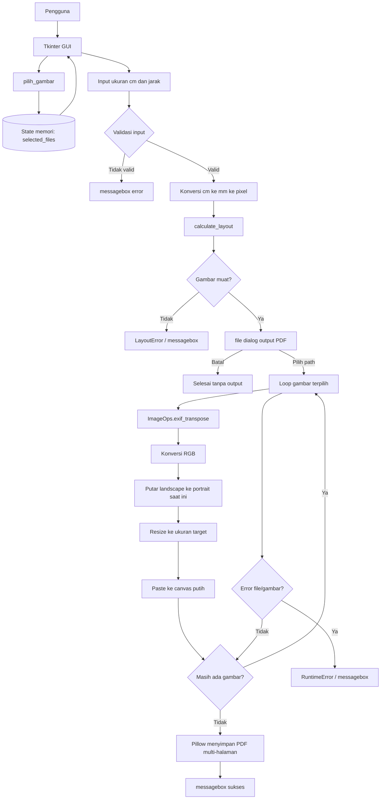
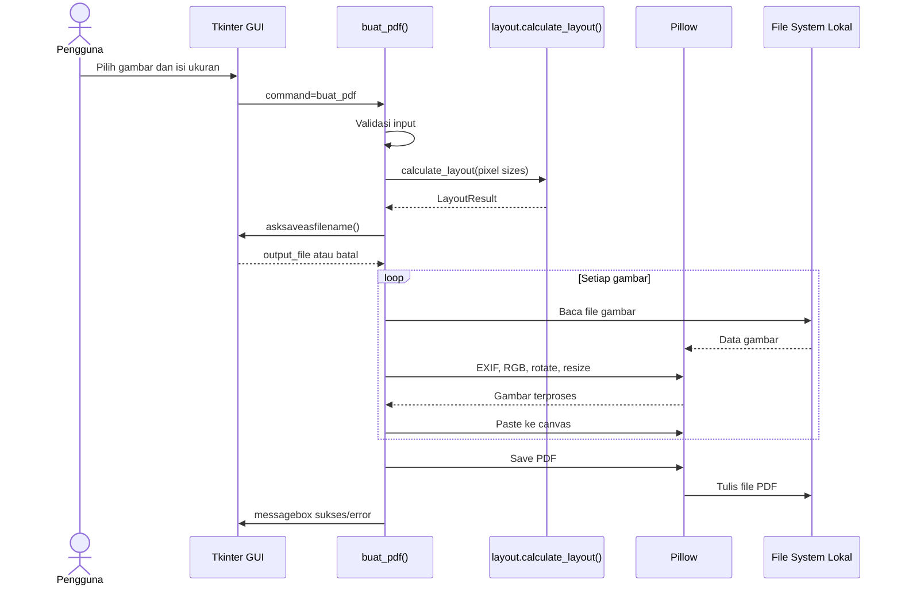

# Arsitektur Sistem — Cetak Gambar Massal

> Berdasarkan `CONTEXT.md` dan source aktual. Tidak menambahkan framework,
> database, backend, atau library baru.

## 1. Ringkasan arsitektur

Aplikasi menggunakan arsitektur **desktop lokal monolitik modular ringan**:

```text
Pengguna → Tkinter GUI → Application Flow → Layout Engine
                                      └──→ Pillow Image/PDF Processing
                                             └──→ File PDF lokal
```

Karakteristik:

- Tidak ada server atau komunikasi jaringan.
- Tidak ada API HTTP/REST.
- Tidak ada database persisten.
- Input dan output berupa file lokal Windows.
- Tkinter menjadi boundary UI.
- Perhitungan layout tidak bergantung pada GUI.
- PyInstaller dan Inno Setup hanya digunakan saat distribusi.

| Area | Keputusan |
|---|---|
| Deployment | Executable Windows lokal |
| Persistence | State hanya selama proses berjalan |
| Database | Tidak digunakan; belum ada kebutuhan histori/akun |
| API | Tidak digunakan; komunikasi internal berupa fungsi Python |
| Image engine | Pillow yang sudah digunakan |
| GUI | Tkinter yang sudah digunakan |
| Packaging | PyInstaller yang sudah digunakan |
| Installer | Inno Setup yang sudah digunakan |

## 2. Struktur folder

### Struktur saat ini

```text
IMG_Resizer/
├── cetak_gambar_massal_portrait_margin_fixed.py  # entry point, GUI, orkestrasi
├── layout.py                                     # kalkulasi layout terisolasi
├── CONTEXT.md                                   # konteks/checkpoint proyek
├── ARCHITECTURE.md                              # dokumen arsitektur ini
├── Cetak Gambar Massal.spec                     # konfigurasi PyInstaller
├── installer.iss                                # konfigurasi Inno Setup
├── icon.ico                                     # icon aplikasi/installer
├── build/                                       # artefak sementara PyInstaller
├── dist/                                        # executable hasil PyInstaller
├── installer/                                   # installer hasil Inno Setup
└── __pycache__/                                 # cache Python lokal
```

### Struktur target bertahap

Struktur ini hanya digunakan saat refactor diperlukan; jangan membuat file kosong atau abstraksi tanpa kebutuhan nyata.

```text
IMG_Resizer/
├── app.py                                        # entry point tipis (opsional)
├── ui/
│   └── main_window.py                            # Tkinter GUI (opsional)
├── domain/
│   ├── layout.py                                 # perhitungan grid
│   └── models.py                                 # model runtime (opsional)
├── services/
│   ├── image_processor.py                        # pemrosesan gambar (opsional)
│   └── pdf_writer.py                             # pembuatan PDF (opsional)
├── tests/                                        # test stdlib bila diperlukan
├── CONTEXT.md
├── ARCHITECTURE.md
├── Cetak Gambar Massal.spec
├── installer.iss
├── icon.ico
├── build/
├── dist/
└── installer/
```

`layout.py` saat ini sudah cukup sebagai modul terpisah. Pemisahan `ui/`, `domain/`, dan `services/` baru dilakukan jika fitur baru membuat file utama sulit dipelihara.

## 3. Pembagian tanggung jawab

### Presentation — Tkinter

- Menampilkan window dan kontrol input.
- Membuka file dialog dan save dialog.
- Menampilkan daftar file terpilih.
- Menampilkan warning, error, dan hasil proses.
- Tidak seharusnya menghitung layout atau memproses pixel secara langsung.

Saat ini berada di `cetak_gambar_massal_portrait_margin_fixed.py`.

### Application flow

- Memastikan file sudah dipilih.
- Membaca dan memvalidasi ukuran.
- Mengubah cm/mm/pixel.
- Memanggil layout engine.
- Mengorkestrasi pemrosesan gambar dan penyimpanan PDF.
- Mengubah exception menjadi pesan pengguna.

Saat ini berada pada fungsi `buat_pdf()`.

### Domain/layout engine

`layout.py` bertanggung jawab untuk menghitung area usable, kolom, baris, kapasitas per halaman, total halaman, dan menolak input invalid.

API internal:

```python
calculate_layout(
    image_width: int,
    image_height: int,
    gap: int,
    page_width: int,
    page_height: int,
    margin: int,
    image_count: int,
) -> dict[str, int]
```

### Infrastruktur lokal

Pillow menangani pembukaan gambar, EXIF, RGB, rotasi, resize, canvas, dan PDF. PyInstaller dan Inno Setup bukan bagian runtime.

## 4. Model data runtime

Aplikasi tidak memakai database. Model berikut hanya hidup selama sesi.

### `ApplicationState`

| Field | Tipe | Wajib | Keterangan |
|---|---|---:|---|
| `selected_files` | `list[str]` | Ya | Path gambar terpilih |
| `image_width_cm` | `float` | Saat generate | Lebar target |
| `image_height_cm` | `float` | Saat generate | Tinggi target |
| `gap_cm` | `float` | Saat generate | Jarak antar gambar |
| `output_file` | `str` | Setelah save dialog | Path PDF tujuan |

### `LayoutResult`

| Field | Tipe | Keterangan |
|---|---|---|
| `columns` | `int` | Jumlah kolom |
| `rows` | `int` | Jumlah baris |
| `per_page` | `int` | Kapasitas gambar per halaman |
| `total_pages` | `int` | Jumlah halaman output |

### Konsep `ImageProcessingResult`

Belum menjadi model formal. Jika progress ditambahkan, dapat memuat `source_file: str`, `status: str`, dan `error_message: str | None`.

## 5. Skema database

### Status: tidak ada database

Database belum diperlukan karena aplikasi hanya memproses file pada satu sesi, tanpa akun, multi-user, sinkronisasi, histori, atau katalog gambar.

```text
Tabel       : N/A
Primary key : N/A
Foreign key : N/A
Relasi      : N/A
Migration   : N/A
```

Jika histori pekerjaan diperlukan, database menjadi perubahan requirement terpisah. Kandidat pertama yang dievaluasi adalah `sqlite3` dari standard library, bukan dependency eksternal.

## 6. Diagram alur sistem desktop

Aplikasi tidak memiliki API network, sehingga diagram berikut mendokumentasikan alur internal.



## 7. Diagram alur API/internal interface

Tidak ada API HTTP/REST. Interface internal yang relevan adalah pemanggilan fungsi Python.



## 8. Teknologi/library yang disetujui

| Teknologi/library | Status | Alasan |
|---|---|---|
| Python 3 | Dipakai | Bahasa implementasi proyek |
| Tkinter | Dipakai | GUI desktop bawaan Python |
| `tkinter.filedialog` | Dipakai | Dialog file Windows |
| `tkinter.messagebox` | Dipakai | Warning, error, dan sukses |
| Pillow | Dipakai | Image processing dan PDF |
| `os` | Dipakai | Manipulasi path/nama file |
| `sys` | Dipakai | Resource path PyInstaller |
| `math` | Dipakai | Perhitungan jumlah halaman |
| PyInstaller | Build | Executable Windows tanpa console |
| Inno Setup | Release | Installer dan shortcut Windows |
| `assert`/stdlib | Dipakai | Self-check tanpa framework baru |

### Teknologi yang sengaja tidak digunakan

- Web framework/server API, REST/GraphQL.
- Database engine dan ORM.
- Frontend web framework.
- Dependency baru untuk state management, logging, async, atau image processing.

Penambahan teknologi harus mengikuti requirement baru dan persetujuan eksplisit.

## 9. Error handling dan keamanan

Boundary yang harus divalidasi:

1. Input numerik GUI.
2. Path file dari dialog Windows.
3. Format dan isi gambar yang dibuka Pillow.
4. Hak tulis lokasi PDF.
5. Memori saat membuat halaman.

Perbaikan yang direncanakan tanpa library baru:

- Gunakan `math.isfinite()` untuk input numerik.
- Bedakan path error, permission, gambar invalid, dan error Pillow.
- Jangan menampilkan traceback teknis sebagai satu-satunya pesan pengguna.
- Tambahkan log lokal hanya jika kebutuhan diagnosis disetujui.

Semua pemrosesan lokal; tidak ada upload gambar. Jangan menyimpan credential, token, API key, atau password. Hindari menimpa output tanpa konfirmasi.

## 10. Batasan performa

- Pemrosesan PDF memblokir event loop Tkinter.
- Semua halaman ditahan dalam list `pages` sebelum ditulis.
- Tidak ada progress bar atau pembatalan.
- Resize memaksa ukuran target dan dapat mendistorsi gambar.
- Landscape diputar ke portrait.

Prioritas optimasi: worker thread aman, progress/cancel, batch/temporary page, lalu mode `fit`/`crop` dan orientasi asli.

## 11. Packaging dan deployment

```text
Source Python
    │
    ▼
PyInstaller (`Cetak Gambar Massal.spec`)
    │
    ▼
dist/Cetak Gambar Massal.exe
    │
    ▼
Inno Setup (`installer.iss`)
    │
    ▼
installer/Setup_Cetak_Gambar_Massal.exe
```

Detail: executable windowed (`console=False`), memakai `icon.ico`, versi installer `1.0.0`, default install `{autopf}\\Cetak Gambar Massal`, dan membutuhkan administrator.

## 12. Pengujian dan quality gates

Saat ini belum ada test suite formal. Jalankan:

```text
python layout.py
python -m py_compile cetak_gambar_massal_portrait_margin_fixed.py layout.py
```

Self-check harus menghasilkan `layout self-check: OK`.

Skenario manual minimum:

- Tidak memilih gambar.
- Input kosong, negatif, dan ukuran terlalu besar.
- Satu gambar dan banyak gambar multi-page.
- JPG, PNG, BMP, dan WEBP valid.
- File non-gambar atau gambar rusak.
- Output dibatalkan.
- Lokasi output tanpa izin tulis.
- File output yang sudah ada.

## 13. Keputusan yang belum boleh diasumsikan

Belum menjadi requirement: database/histori, API/network, login, multi-user, cloud, ukuran kertas selain A4, preview, mode crop/fit default, logging permanen, framework testing eksternal, dan dependency baru.

## 14. Checklist perubahan arsitektur

Setiap perubahan berikutnya harus:

- Memperbarui `CONTEXT.md` dan `ARCHITECTURE.md`.
- Memakai teknologi yang sudah disetujui.
- Mempertahankan pemrosesan lokal kecuali requirement berubah.
- Menambahkan validasi pada boundary input/output.
- Menyediakan self-check atau test kecil untuk logika non-trivial.
- Memverifikasi source dengan syntax check dan uji relevan.
- Tidak menyimpan data sensitif ke file.

## 15. Status dokumen

- **Tanggal checkpoint:** 2026-09-30.
- **Basis:** source aktual dan `CONTEXT.md`.
- **Status:** baseline arsitektur desktop lokal; belum mencakup fitur yang belum disetujui.


